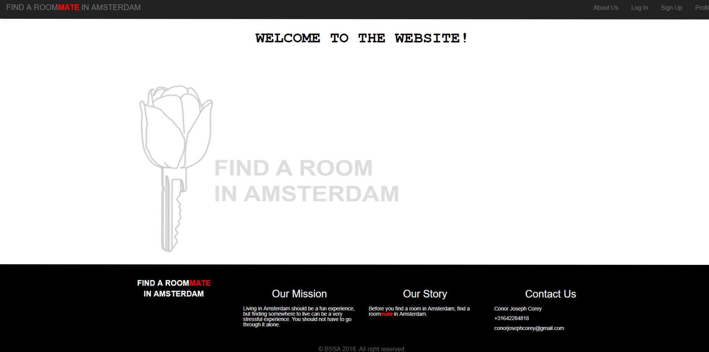

# _Individual Project Design Brief / Project Specifications_

Before you find a room in Amsterdam....

Find a roomMATE in Amsterdam

# _Design Brief:_

_State the purpose of your application clearly and concisely. Try to do it in a single sentence._

"Tinder for Roommates"

My application will try to match up people who are looking for a room in Amsterdam, with other people who are looking to find a room in Amsterdam, so that they can search together and hopefully live together.

The working name at the moment is "Flat Mate Finder", but this will change when I think of a better name.

###### _Answer the following questions as you did in your Group Project:_

_- What is the problem you are trying to solve?_
_- Who is your target audience?_
_- What are your specific goals?_

Amsterdam is a very difficult city to live in, and one of the biggest struggles that everyone faces when they move here is finding somewhere to live.

The demand for housing in Amsterdam is much greater than the supply, and as the city is already so small and so densely populated, this has created massive competition for housing, which is getting more and more expensive.

(https://www.theguardian.com/world/2017/aug/10/no-cooking-in-kitchen-disbelief-amsterdam-rental-flat-rules)

When you first arrive in a new city, it can be incredibly intimidating, as there is so much to do (setting up a bank account, finding a job, getting a BSN appointment), and finding somewhere to live can often be the most stressful part.

I am still part of several Facebook groups for finding a room in Amsterdam, and these groups are either people advertising themselves to say that they are looking for somewhere to live, people who are advertising a room and are looking for someone to move in, or people who have (almost) been the victim of a scam which is often a falsely advertised room and are warning other users what to look out for.

Often people who move here will be on a tight budget of what they can afford so this can limit the options of what they can look for, and may force someone to take a very small room where they are not even allowed to make use of parts of the apartment (see link above).

The idea of my application is that people who are moving to / have just moved to Amsterdam can create an account, make a profile for themselves and then will answer 5 questions about their lifestyle. Based on these answers, the user will be shown other users who would be good roommate or an excellent roommate. After this the matched users can directly message each other and exchange personal information, and hopefully look for somewhere to live together.

What I would like to do is offer a platform where people who are trying to find a room in Amsterdam, can first find a potential roommate in Amsterdam. This way, they can share knowledge, funding and can search together. This can be particularly beneficial if one person is unable to go to a viewing due to other commitments.  It can be very difficult, risky and time consuming to search for somewhere to live on your own, and that is why you should use my application.

The specific goals of this application are as follows:

1. Match up people who are trying to find somewhere to live in Amsterdam
2. Meet new people
3. Increase the number of possibilities for housing which would not have been affordable alone
4. Ultimately make it easier and less risky for people to find somewhere to live in Amsterdam

###### _In another block, answer the following:_

_- What is your business model?_ _-Where is your revenue coming from?_
_- What are the costs of your business?_

The concept of this business will be that users are likely to be active members for a short time as once they find a place to live they will have no immediate need for the application again. This is a different business model as it will not be dependent on repeat business from the same customers, but we hope that through positive experiences and word of mouth recommendations that the application will be used by new people moving to Amsterdam.

Therefore it will be vital to have a strong online presence through online marketing on social media such as Facebook, Instagram and Twitter.

It is also unrealistic to expect to charge people for use of the application, and it is unlikely that they will pay for a monthly subscription. Therefore revenue will have to come from different sources, primarily from advertising. We will offer advertising space to businesses which are likely to be used by people who are living here for the first time (such as IKEA or the HEMA).

The costs of the business will include:

#### Full Stack Developers
- The website will need to be very user friendly and presentable, but it is important that all of the information is being stored and processed correctly in the back end. If we wish to try new features and ideas in the future then these developers will be essential in order to implement them. The developers will also be responsible for website maintenance, in order to make sure that the site is functional.

#### Advertising
- For the launch of the product it will be critical to ensure that people are made aware of its existence. This can be achieved through the use of social media such as Twitter, Facebook, Instagram etc.

###### _Market research:_
_- Who is your current competition?_

Currently, the idea is highly disorganized on Facebook. I have seen post on some groups, such as "Find a room in Amsterdam", where people will ask if anyone is looking for a room, and perhaps they should look together.

Rooms are advertised on Facebook, Craigslist, Kamernet etc. and I have seen many people posting to Facebook with information such as:

- Country of origin
- Occupation / study pathway
- Personality type
- Budget

This web application will let you browse profiles of people who are also searching for a room, but will also make suggestions based on the sorting algorithm of who might be an ideal housemate for you. If you see someone who you think would be a good housemate then it will be possible to contact them and exchange contact information.

_- How is your product different from currently available competitors?_
_- What is the current supply / demand for your product?_

There is a website based in the US called Rommies, (https://www.roomies.com/find-place) and this lets users find a room mate to be paired up with and is also a place for advertising rooms. However this site takes into account other information, such as whether or not the user has children or pets, and also their sexual orientation.

We will not be asking for this kind of information because it is much more unlikely that someone would be moving to Amsterdam with their children/pets and not have arranged somewhere to stay (as this is incredibly irresponsible). No questions will be asked about sexual orientation to avoid possible privacy and discrimination issues.

This application is different in that it is targeted on a single city, and is not about turning a huge profit, but rather it exists to provide a service to help prevent the exploitation of people who have just moved to Amsterdam.

I believe that there is a huge demand for this kind of service, as finding somewhere to live in Amsterdam can be a huge challenge.

# _Technical Specifications:_

_- What data will you need to store? How will it be organized? Describe each table, its columns, and its relationships with other tables._
_- What does your product look like? List each view, their purpose, and how they work_
_- Describe any complex business logic that is happening in your application. For example, how does data flow through your application_

## Workflow

- A user will go the website and arrive at the **Home** page. From here there will be a welcoming message explaining the concept of the website clearly and concisely. Users will be prompted to create an account and sign up.
- If the user would like more information about how the website works and why they should use it, they can choose to go to the **How it Works** page. From the **Home** page the user can utilize the buttons on the Navbar to go to **Sign Up**, **Login** and **Profile**.
- Once the visitor completes **Sign up** they will be brought to their **Profile** page. From here several new options will be available. Before the user is able to view any of these options they will be required to complete the **Lifestyle** form. Clicking on this option will bring the user to a new page called **Lifestyle**.
- On the **Lifestyle** page, there will be a form that the user will be asked to fill in to help build a profile of their lifestyle. This form will use either drop down menus, or radio buttons to answer 5 questions. The drop down/radio buttons are deliberately limited to make it easier to clearly store information in the table which we will later retrieve.

The user will be asked to fill in a form using either radio buttons or from a dropdown menu for the following information:

|  Profession    |  Sleep        |  Smoking     | Budget           |  Duration     |
|----------------|---------------|--------------|------------------|---------------|
|  Full-Time     |  Early-Bird   |  Smoker      | < €599           |  < 6 months   |               
|  Part-Time     |  Night-Owl    |  Non-Smoker  | €600 - €800      |  6-12 months  |
|  Student       |               |              | > €800           |  > 12 months  |

- Once the user has selected their five answers and pressed submit, they will be brought to another page called **LifestyleConfirmation**, where they will be shown a summary of their answers, and asked if they are absolutely sure of their choices, as they will be locked into their choices (for now it will be impossible to change the answers, but in future this could be changed to 1 week or 72 hours).
- After confirmation, the user will be brought to a page called **Matches**, where the user will be shown all of the _**Good Matches**_ and all of the  _**Excellent Matches**_

- The basic algorithm for matching users will be:
- 0/1 answers in common : No match (and the other user will not appear as a suggestion in the **Matches** page)
- 2/3 answers in common : Good match
- 4/5 answers in common : Excellent match!

- From here it will be possible to see a list of all the matches, but the only visible information is the **Username** and the  **About** which will be acquired from the **User** table (see below), to protect the privacy of the other person at this point.
- However, it will be possible to select a suggested user and directly contact them on a **Message** page using some kind of messaging application (possibly SendGrid). Here users can exchange whatever information they want, and can decide if they want to meet up in real life to discuss hunting for a room.
- If a user leaves at any point or signs out, when they login and return to their profile, there will be an button which will take them to the suggested **Matches** page again.

## Tables

    Table "User"

This will be a list of all of the users who create an account with our application.

The columns will be:

- User Id (integer) (each business will be assigned a unique Id with a serial primary key)
- Username (string)
- FirstName (string)
- LastName (string)
- Age (integer)
- About (string)
- Email (string)
- Password (string) (the passwords will also be encrypted)

| User ID   | Username     | FirstName     | LastName      | Age    | About        | Email                       | Password      |
|-----------|--------------|---------------|---------------|--------|--------------|-----------------------------|---------------|
| 1         | conor        | Conor         | Corey         | 30     | I'm nice     | conorjosephcorey@gmail.com  | ........      |

    Table "Lifestyle"

This will be a list of all of the lifestyle options that users will be asked to provide after they create an account with our application

This table will have a _One-to-One_ Relationship, because each user can have only one lifestyle. The **UserID** will appear as a Foreign Key in the Table **Lifestyle**, and will give us access to information in the **User** table.

| Lifestyle ID (PK)  |  Profession    | Sleep        |  Smoking     | Budget      |  Duration       |  User ID (FK)   |
|--------------------|----------------|--------------|--------------|-------------|-----------------|-----------------|
| 1                  |  Full-Time     | Early-Bird   |  Non-Smoker  | €600 - €800 |  > 12 months    |  1              |
| 2                  |  Student       | Night-Owl    |  Non-Smoker  | €600 - €800 |  < 6 months     |  2              |     
| 3                  |  Part-Time     | Early-Bird   |  Smoker      | < €599      |  6 - 12 months  |  3              |
| 4                  |  Student       | Night-Owl    |  Non-Smoker  | €600 - €800 |  < 6 months     |  4              |
| 5                  |  Full-Time     | Night-Owl    |  Smoker      | > €800      |  6 - 12 months  |  5              |    
| 6                  |  Part-Time     | Night-Owl    |  Smoker      | < €599      |  > 12 months    |  6              |
| 7                  |  Part-Time     | Early-Bird   |  Non-Smoker  | > €800      |  6 - 12 months  |  7              |                        
| 8                  |  Student       | Early-Bird   |  Smoker      | < €599      |  6 - 12 months  |  8              |                        

The columns will be:

- Lifestyle ID (integer) (each lifestyle will be assigned a unique Id with a serial primary key)
- Profession (string)
- Sleep (string)
- Smoking (string)
- Budget (string)
- Duration (string)
- User ID (integer) (Foreign Key)

## Dependencies and Quick setup guide

To get this application working you will need to run the following in the command line:

    npm install sequelize express ejs express-session body-parser connect-session-sequelize bcrypt

otherwise download the package.json and in the command line run:

    npm i

Here is a list of all of the modules that we will be requiring (more might be added as necessary):

    const Sequelize = require('sequelize');
    const express = require('express');
    const ejs = require('ejs');
    const session = require('express-session');

    const bodyParser = require('body-parser');
    const SequelizeStore = require('connect-session-sequelize')(session.Store)

    const bcrypt = require('bcrypt');

## Website Appearance Ideas (Concept)

### Logo, Name Ideas

The logo will be based around things associated with Amsterdam such as tulips and the XXX symbol and also the theme of looking for a place to live (keys and buildings).

### Lifestyle Form Ideas \ Header and Footer Ideas

If there were more time to complete the project I would like to use custom made logos to replace the drop down menu/radio buttons on the **Lifestyle** form. Here are some ideas.

## ROUTES

### Home Page

This will be the first page that users arrive at. It will welcome them to the web application and encourage them to navigate the page.

### About Us

This will explain the concept of the application in greater detail and answer questions that users might have.

### Sign up

This will allow someone to sign up for the application.

### Login

This will allow a user to login in to their account.

### Profile

The user can go to their profile. From here several options are available, such as completing the **Lifestyle** quiz (which will be locked out after completion and confirmation), and viewing suggested matches.

### Lifestyle

The user will be asked to answer 5 questions about themselves and their motivations.

### Lifestyle Confirmation

After answering the 5 questions the user will be shown a summary and then asked to confirm their options, because once they confirm it will not be possible to change any of their answers for a set period of time.

### Matches

The user will see other users who are good matches or excellent matches. It will be possible to see their username and a short description (taken from the **about** section in the **User** table).

### Messaging

Users who are a good match or an excellent match have the option to directly message one another.

###### _Have a timeline of milestones to reach, including deadlines:_

_- Create milestones that represent the discrete blocks of functionality._
_- Give an estimate for how long each will take._
_- Determine whether things can be built concurrently._
_- Come up with a timeline of goals to stick to._

## Milestones

### New things I would like to learn or try during this assignment

- Storing photos in a database and retrieving
- Pairing users based on matching criteria

## Predicted Timeline

#### Monday 08 - Friday 19 October

- Brainstorming ideas
- Writing initial documentation

#### Tuesday 23 October

- Successfully pitched individual project idea

#### Wednesday 24 October

- Presentation of Group Project so now full attention can be given to Individual Project

#### Thursday 25 October

- Figure out what routes and dependencies are needed
- Make wireframes and begin thinking about the site layout and design, including UI Style Guide
- Begin working on table relationships
- Decide on a name and logo

#### Friday 26 October

- Finish Design Brief and Technical Specifications for submission
- Finalize table relationships
- Establish basic routing and functionality on paper

#### Saturday 27 & Sunday 28 October

- Begin building website (creating .ejs files, organizing public folder etc.)
- Design logo for the application and finalize wireframes

#### Monday 29 October

- Add basic functionality such as signup, login, navbar and footer
- Create 8 users in the database for testing purposes
- Begin working on the matching functionality

#### Tuesday 30 October

- Improve styling and user interface
- Continue working on the matching functionality

#### Wednesday 31 October

- Add some basic jQuery features
- Finalize matching functionality

#### Thursday 01 November

- Error testing and bug fixing

#### Friday 02 November

- Last minute fixes and improvements
- Final presentation

#### Bug Fixing and Functionality to Add:

Short-term

- If there are no matching users render a **nomatch** page
- Fix the error on the login page when a user tries to sign in with incorrect details

Long-term

- Add functionality for 'good matches' and 'excellent matches'
- Add a messaging functionality
# findaroomMATEinamsterdam
